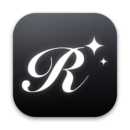

<div align="center">



# ✨ RizzStudio ✨

### Your Ableton set in, a full AI lightshow out.

<p>
  
  
  
  
</p>
<p>
  
  
  
  
</p>

<a href="https://github.com/nmnvisuals2/rizzstudio-app/releases/latest/download/RizzStudio-macOS.zip">
  
</a>

<sub><a href="https://github.com/nmnvisuals2/rizzstudio-app/releases">All releases</a> · <a href="docs/GUIDE.md">Full guide</a></sub>

</div>

---

## 🎛️ What it does

**RizzStudio** reads an Ableton Live set (or plain audio files), analyses every song and uses AI to program
a show beat by beat. It then exports that show back **into Ableton as DMX-over-MIDI**, so Ableton alone drives
your rig through **TouchDesigner → Art-Net / sACN / DMX**.

```
 🎵 .als / audio  →  🔬 analysis  →  🤖 AI plan  →  🎚️ programmer  →  🎹 Ableton MIDI  →  💡 lights
```

## ⚡ Highlights

| | |
|---|---|
| 🔬 **Instant analysis** | Tempo, key, sections, drops, swing and silences, at under 1 s per song |
| 🤖 **AI lighting designer** | Uses your local **Claude Code** or **Codex** CLI, so no API key is needed |
| 🎯 **Granular cues** | 1–8 bar chunks, with pre-drop hits, numbered drops and blackouts on cuts |
| 🕺 **Full rig** | Moving heads, washes, strobes, lasers, pixel bars, haze, CO₂, sparkulars and flames |
| 🎥 **3D stage + Perform mode** | Live preview, DMX monitor, solo/mute and master blackout |
| 📺 **LED-wall aware** | Samples colours from Syphon video |
| 🔌 **Plays nice** | Ableton, TouchDesigner receiver `.tox`, Art-Net and sACN |

## 🚀 Install

1. **[Download `RizzStudio-macOS.zip`](https://github.com/nmnvisuals2/rizzstudio-app/releases/latest/download/RizzStudio-macOS.zip)** and unzip it.
2. Drag **RizzStudio.app** into **Applications**.
3. The first time, **right-click → Open**. The app isn't notarized, so macOS will ask once. If it still refuses, run:
   ```sh
   xattr -dr com.apple.quarantine /Applications/RizzStudio.app
   ```

> 🧠 **AI planning (optional):** install [Claude Code](https://claude.com/claude-code) (2.1.280+) or the Codex CLI.
> Without one, the built-in rules engine plans the show.


## 📖 Learn more

The workflow, timeline controls, DMX protocol, AI engines, headless CLI and code layout are all covered in the
**[Full Guide →](docs/GUIDE.md)**

---

<div align="center">
<sub>Made with 💡 by <b>NMN Visuals</b> · Syphon framework © Syphon authors (BSD-2)</sub>
</div>
